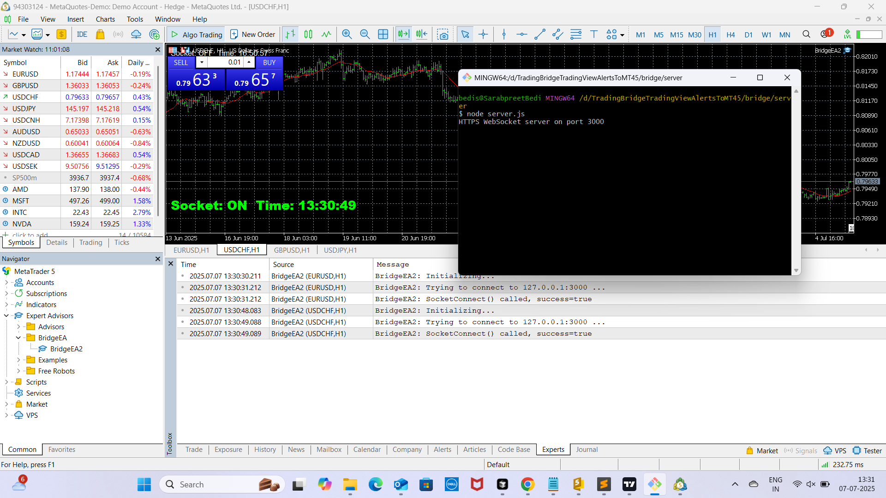
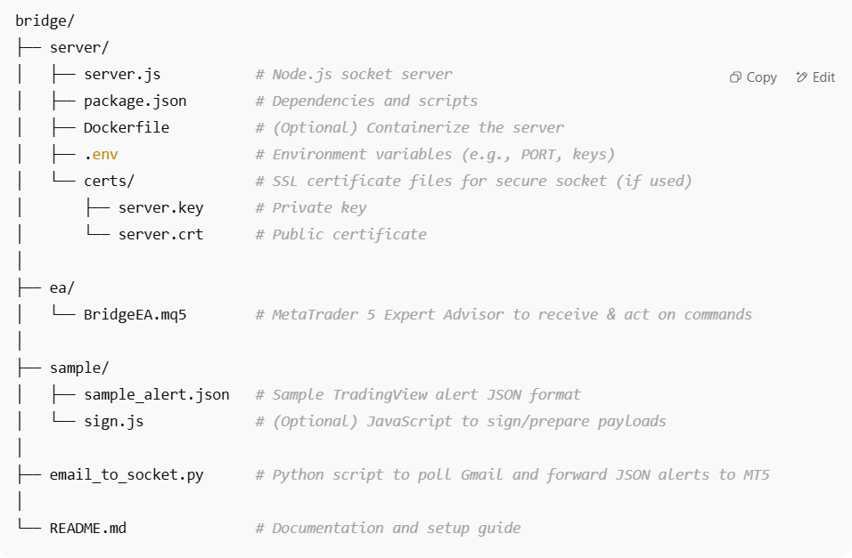
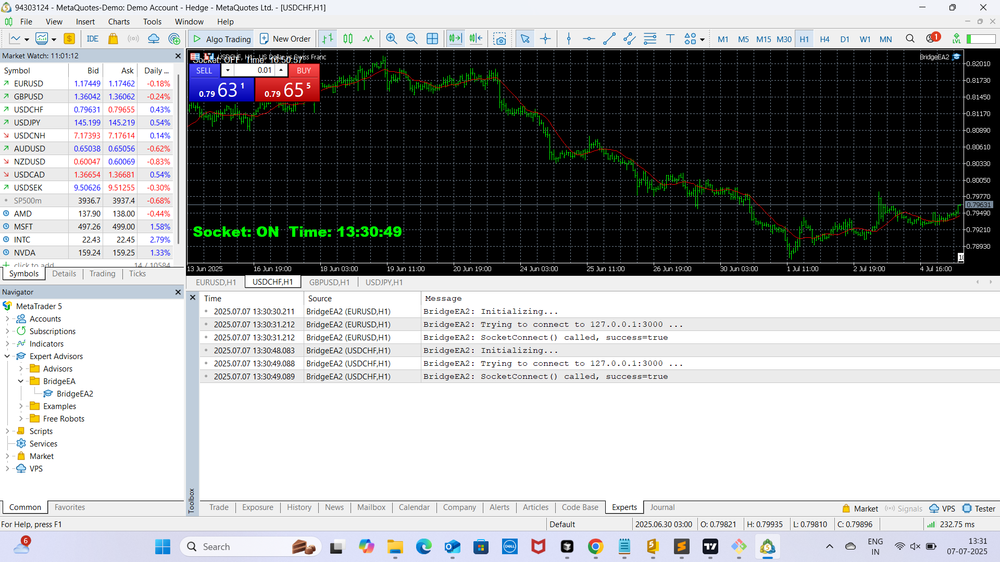
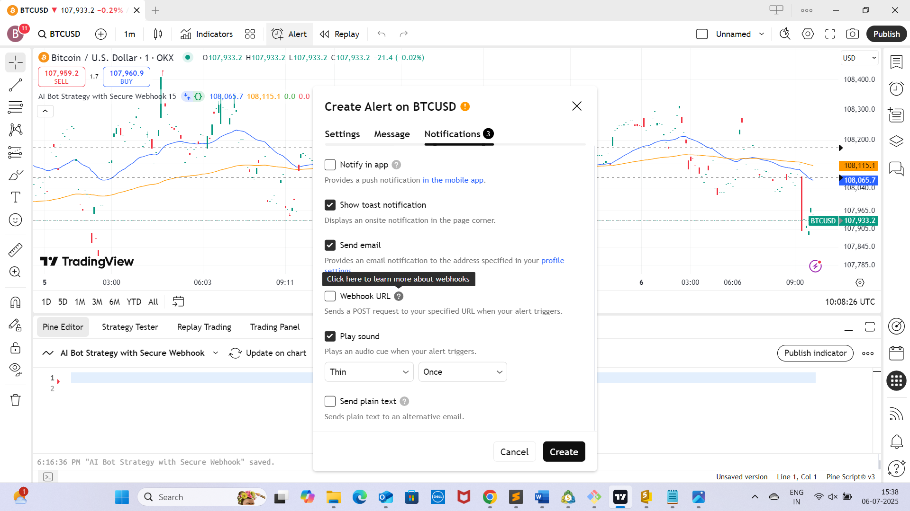
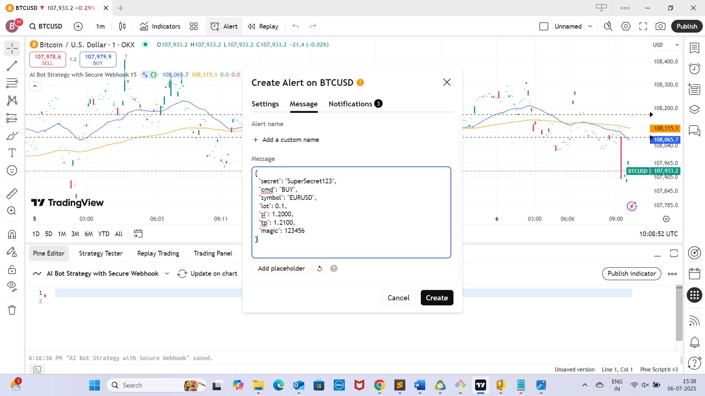
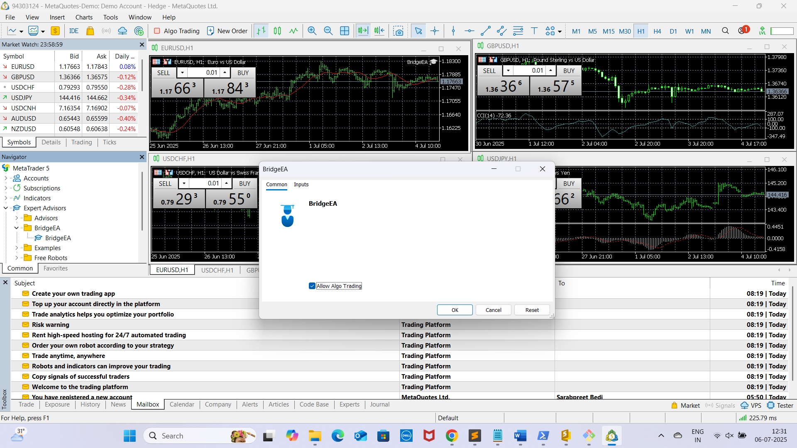

<!-- Dark Background Styling for GitHub (simulated with code blocks) -->

<div style="background-color:#1e1e1e; color:#d4d4d4; padding:20px; border-radius:10px;">

<h1>🚀 <span style="color:#4ec9b0;">TradingView to MT4/MT5 Bridge</span></h1>

<p align="center">
  
</p>

> <span style="color:#dcdcaa;">Secure, Real-Time Bridge Between TradingView Alerts and MetaTrader 4/5</span>

---

## 📌 Overview

This project enables **auto-execution** of TradingView alerts on MetaTrader 4/5 via a **secure, encrypted bridge**. Designed for **low-latency trading** and **multi-broker compatibility**, it supports any instrument on both demo and live accounts.

### 🔧 Components

- 🖧 **Node.js Server** – Receives webhook alerts via secure WebSocket (WSS).
- 🤖 **MT5 Expert Advisor (EA)** – Executes trades based on received alerts.

---

## 🗂️ Project Structure

<p align="center">
  
</p>

---

🖼️ Screenshots

MetaTrader EA Connected	TradingView Alert Setup

	
  
  

## 🖥️ Setup Guide (Windows 11)

### 1️⃣ Install Prerequisites

| Tool         | Link                                                                 |
|--------------|----------------------------------------------------------------------|
| Node.js      | [https://nodejs.org](https://nodejs.org)                             |
| MetaTrader 5 | [Download MT5](https://www.metatrader5.com/en/download)              |
| OpenSSL      | [Win32 OpenSSL](https://slproweb.com/products/Win32OpenSSL.html)     |

💡 **Tip**: Use Git Bash (comes with OpenSSL)

---

### 2️⃣ Setup Node.js Server

```bash
cd path\to\bridge\server
npm install
3️⃣ Generate SSL Certificates (Localhost Testing)

mkdir certs
openssl req -x509 -newkey rsa:4096 -nodes \
  -keyout certs/server.key -out certs/server.crt \
  -days 365 -subj "/CN=localhost"
📁 Place server.key and server.crt in bridge/server/certs/

4️⃣ Create .env File

PORT=3000
SECRET=SuperSecret123
AES_PASS=MyAESPassphrase
🔒 Keep this file secure. Keys must match your EA.

5️⃣ Run the Server

node server.js
✅ Server is live at: https://localhost:3000

6️⃣ Setup MetaTrader 5 EA
Copy BridgeEA.mq5 to:MQL5/Experts/

1)Open MetaEditor, compile BridgeEA.mq5

2)Attach the EA to any chart

3)Configure Inputs:

  SocketServer: 127.0.0.1
  
  SocketPort: 3000
  
  AES_PASS: Same as in .env
  
  RetrySec: 10

📡 EA will connect to the Node.js server and listen for alerts.

🧪 Testing Alerts
Sample JSON Alert

{
  "secret": "SuperSecret123",
  "cmd": "BUY",
  "symbol": "EURUSD",
  "lot": 0.1,
  "sl": 1.20,
  "tp": 1.25,
  "magic": 123456,
  "trail": 0.03
}

Send it via:

🧪TradingView Alert (Actual Example)

Inside TradingView's alert box:
json

{
  "cmd": "BUY",
  "symbol": "EURUSD",
  "lot": 0.1,
  "sl": 20,
  "tp": 40
}
You will need something like email_to_socket.py oR
TradingView webhook → WebSocket bridge to forward the alerts to ws://localhost:8080.


📚 MQL5 Libraries Needed

Library	Purpose
SocketLib.mqh	WebSocket/TCP Client
Base64.mqh	Base64 Encode/Decode
JSON.mqh	JSON Parsing (from Codebase)

📥 Download from: MQL5 Codebase

📬 Email-to-Socket Alternative (Free TradingView Accounts)
Send alerts via email instead of webhooks.

🛠️ Steps
Run the script:

cd bridge/
python3 email_to_socket.py

In TradingView:

Enable “Send Email” in alert

Add your target email (e.g., Gmail)

Use this JSON in the alert message:


{
  "secret": "SuperSecret123",
  "cmd": "BUY",
  "symbol": "EURUSD",
  "lot": 0.1,
  "sl": 1.2000,
  "tp": 1.2100,
  "magic": 123456
}

The script:

Logs into Gmail

Reads new alerts

Sends them to the MT5 EA securely

🔁 Checks inbox every 10 seconds

🔗 Useful Links
🌐 Node.js & npm: https://nodejs.org/

📉 MetaTrader 5: https://www.metatrader5.com/en/download

🔐 OpenSSL: https://slproweb.com/products/Win32OpenSSL.html

🛡️ Notes & Best Practices
✅ Use CA-signed SSL certificates in production

🔐 Keep your AES keys & secrets confidential

📝 Log file stored at: BridgeHistory.log

🌍 Extend EA for multi-account support if needed


📄 License
MIT License – See LICENSE

